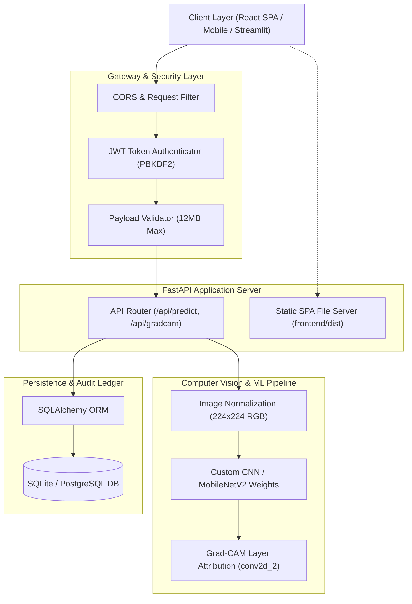

# 🌿 PlantGuard AI — Enterprise Deep Learning Plant Pathology Platform

[](https://www.python.org/)
[](https://fastapi.tiangolo.com/)
[](https://react.dev/)
[](https://tailwindcss.com/)
[](https://www.tensorflow.org/)
[](https://www.docker.com/)
[](tests/)
[](LICENSE)

An enterprise-grade, full-stack agricultural decision support system designed to autonomously classify **38 distinct crop diseases and healthy conditions** from leaf imagery. Features real-time neural inference, **Grad-CAM visual explainability**, cryptographically authenticated audit trails, and an ultra-reactive **React Single-Page Application (SPA)** with synchronized dual-theme styling.

---

## 📑 Table of Contents

- [System Architecture](#-system-architecture)
- [Key Features](#-key-features)
- [Model Performance & Benchmarks](#-model-performance--benchmarks)
- [Project Directory Structure](#-project-directory-structure)
- [REST API Reference](#-rest-api-reference)
- [Quick Start Guide](#-quick-start-guide)
- [Production Deployment](#-production-deployment)
  - [Docker & Container Deployment](#docker-deployment)
  - [Docker Compose](#docker-compose-orchestration)
  - [Cloud Platforms (Render / Railway / AWS)](#cloud-platform-deployment)
- [Automated Testing & Quality Gates](#-automated-testing--quality-gates)
- [License](#-license)

---

## 🏛 System Architecture



---

## ✨ Key Features

### 1. 🧠 High-Precision Neural Classification
- Evaluates **38 crop pathologies and healthy conditions** across 14 commercial crops (Tomato, Corn, Apple, Potato, Grape, Cherry, Peach, Pepper, Strawberry, etc.).
- Normalized **224×224 px RGB** tensor inference pipeline with calibrated softmax distributions.

### 2. 🔍 Explainable AI (Grad-CAM Heatmaps)
- Visualizes convolutional gradient flow through the final feature maps (`conv2d_2`).
- **Interactive Before/After Slider:** Slide across the leaf to inspect the raw foliage against the localized thermal lesion attribution map.
- Dual-mode viewing: Interactive split slider, side-by-side comparison, or raw heatmap overlay with one-click PNG download.

### 3. 🎨 State-of-the-Art Reactive Frontend
- **Dual-Theme Engine:** Seamlessly toggle between **Dark Cyber-Forest (🌲)** and **Light Botanical Mist (🍃)** with zero layout flash.
- **Optimistic State Management:** Instant bookmarking and optimistic deletion of audit records with automatic **"Undo"** toast recovery.
- **Zero Cumulative Layout Shift (CLS = 0):** Shimmering skeleton states eliminate layout jumps during tensor computation.
- **Synthetic Calibration Leaves:** Generates instant test specimens (Tomato Blight, Corn Rust, Pristine Foliage) on-the-fly via HTML5 Canvas.

### 4. 📋 Agronomic Treatment Encyclopedia & Exportable Slips
- Provides targeted **Immediate Actions**, **Organic Biologicals**, and **Chemical Control Fungicides/Bactericides** for identified pathologies.
- **Printable Agronomic Slip:** Native `@media print` formatted prescription slips ready for field agronomists.
- **38-Class Pathology Compendium:** Searchable crop dictionary with treatment protocols for all supported classes.

### 5. 🔐 Enterprise Security & Audit Ledger
- Cryptographically secure password hashing (`PBKDF2-HMAC-SHA256` with salt).
- Signed JWT bearer authentication (`HS256`) with customizable session expiration.
- SQLite relational persistence storing inference records, confidence metrics, and timestamps.

---

## 📊 Model Performance & Benchmarks

Trained on the standardized PlantVillage benchmark dataset containing **54,305 curated foliage images** across 38 classes:

| Model Architecture | Input Tensor | Test Accuracy | Macro F1-Score | Parameter Size |
| :--- | :---: | :---: | :---: | :---: |
| **Custom Deep CNN** *(Default Production)* | 224 × 224 × 3 | **95.52%** | **94.02%** | ~589 MB |
| **Fine-Tuned MobileNetV2** | 224 × 224 × 3 | **97.38%** | **96.49%** | ~22.7 MB |

### Key Confusion Patterns Resolved
- **Corn Pathologies:** Fine-tuning significantly eliminated misclassification between Cercospora Leaf Spot, Common Rust, and Northern Leaf Blight.
- **Tomato Blights:** Grad-CAM attribution isolates concentric lesions in Early Blight vs. water-soaked margins in Late Blight.

---

## 📂 Project Directory Structure

```text
Plant-Disease-Detection/
├── backend/                        # Production FastAPI Service
│   ├── config.py                   # Centralized Pydantic/Environment Settings
│   ├── app.py                      # FastAPI App, Endpoints & SPA Static Mount
│   ├── database.py                 # SQLAlchemy Engine & Session Factory
│   ├── models.py                   # Relational ORM Schemas (Users, Predictions)
│   ├── model_service.py            # Neural Inference & Grad-CAM Generator
│   └── security.py                 # PBKDF2 Hashing & JWT Token Lifecycle
├── frontend/                       # Modern React + Tailwind CSS SPA
│   ├── src/
│   │   ├── components/             # Modular React UI Components
│   │   │   ├── AuthModal.jsx       # Authentication & Demo Credential Filler
│   │   │   ├── ClassSpectrumExplorer.jsx # 38-Class Pathology Compendium
│   │   │   ├── GradCamViewer.jsx   # Interactive Before/After Split Slider
│   │   │   ├── HistoryDrawer.jsx   # Optimistic Audit Trail & Filter Drawer
│   │   │   ├── ImageUploader.jsx   # Ingestion, Drag & Drop, Canvas Presets
│   │   │   ├── ModelStats.jsx      # Dynamic Metric & Ledger Cards
│   │   │   ├── Navbar.jsx          # Live Status Heartbeat, Theme Switcher
│   │   │   ├── PredictionResult.jsx# Diagnosis Hero, Slips & Softmax Spectrum
│   │   │   └── ToastContainer.jsx  # Non-blocking Reactive Toasts
│   │   ├── context/
│   │   │   └── AppContext.jsx      # Central Store with Optimistic Actions
│   │   ├── api.js                  # Typed API Client with JWT Interceptors
│   │   ├── diseaseInfo.js          # Agronomic Treatment & Advisory Database
│   │   ├── App.jsx                 # Application Shell & Workspace Layout
│   │   ├── App.css                 # Component Styles & Print Media Rules
│   │   └── index.css               # Dual-Theme Tokens & Tailwind Integration
│   ├── index.html                  # SEO Meta Tags, Fonts & Microdata
│   └── vite.config.js              # Vite Engine with Tailwind Plugin & Proxy
├── ml_pipeline/                    # Model Training & Evaluation Pipelines
│   ├── train_mobilenetv2.py        # 2-Phase Transfer Learning Pipeline
│   └── train_cnn.py                # Deep Custom CNN Pipeline
├── model/                          # Model Weights & Metadata
│   ├── class_names.json            # 38 Canonical Pathology Classes
│   ├── custom_cnn_best.keras       # Custom CNN Weights (Tracked via Git LFS)
│   └── mobilenetv2_finetuned_best.keras # MobileNetV2 Weights
├── tests/                          # Automated Pytest Suite
│   ├── test_application.py         # End-to-End API & SPA Tests
│   ├── test_database.py            # Relational Integrity Tests
│   └── test_security.py            # Password Hashing & JWT Expiration Tests
├── Dockerfile                      # Multi-Stage Production Container Build
├── docker-compose.yml              # Local & Cloud Orchestration Blueprint
├── render.yaml                     # Render.com Infrastructure-as-Code Spec
├── Procfile                        # PaaS Web Process Entrypoint
├── run_fullstack.bat               # 1-Click Windows Full-Stack Launcher
├── run_app.bat                     # 1-Click Windows Streamlit Launcher
├── app.py                          # Standalone Streamlit Evaluation Dashboard
├── requirements.txt                # Production Python Dependencies
└── .env.example                    # Environment Variable Template
```

---

## 📡 REST API Reference

All protected endpoints require an `Authorization: Bearer <token>` header.

| Method | Endpoint | Access | Description |
| :--- | :--- | :---: | :--- |
| `GET` | `/api/health` | Public | System healthcheck and model status probe |
| `GET` | `/api/model-info` | Public | Architecture specs, input resolution, and class count |
| `POST` | `/api/auth/register` | Public | Register a new agronomist profile (`username`, `password`) |
| `POST` | `/api/auth/login` | Public | Authenticate and obtain JWT bearer token |
| `POST` | `/api/predict` | Protected | Multipart upload (`image`). Returns top-3 predictions and persists audit record |
| `POST` | `/api/gradcam` | Protected | Multipart upload (`image`). Returns predictions and base64 Grad-CAM heatmap |
| `GET` | `/api/history` | Protected | Retrieves authenticated user's past 10 diagnostic records |

### Sample Inference Response (`POST /api/predict`)

```json
{
  "prediction": {
    "class_name": "Tomato - Early Blight",
    "confidence": 0.9824
  },
  "top_predictions": [
    { "class_name": "Tomato - Early Blight", "confidence": 0.9824 },
    { "class_name": "Tomato - Target Spot", "confidence": 0.0121 },
    { "class_name": "Tomato - Bacterial Spot", "confidence": 0.0035 }
  ],
  "model": "custom_cnn_best",
  "record_id": 14,
  "authenticated_user": "admin"
}
```

---

## 🚀 Quick Start Guide

### Prerequisites
- **Python:** 3.10 to 3.12 installed
- **Node.js:** v18+ and `npm` installed
- **Git & Git LFS:** Required for model weight cloning

### 1. Clone & Set Up Environment

```bash
git clone https://github.com/Moulya-21/plant-disease.git
cd plant-disease

# Create and activate Python virtual environment
python -m venv venv

# Windows
.\venv\Scripts\activate
# Linux/macOS
source venv/bin/activate

# Install Python dependencies
pip install -r requirements.txt
```

### 2. Build the React SPA Frontend

```bash
cd frontend
npm install
npm run build
cd ..
```

### 3. Configure Environment Variables

```bash
cp .env.example .env
```

### 4. Run the Full-Stack Application

**Windows 1-Click Launcher:**
```powershell
.\run_fullstack.bat
```

**Manual Terminal Command:**
```bash
uvicorn backend.app:app --host 127.0.0.1 --port 8000 --reload
```

Open your browser at: **`http://127.0.0.1:8000`**

> **Evaluation Credentials:**  
> Username: `admin`  
> Password: `admin123`

---

## 🐳 Production Deployment

### Docker Deployment

Build and run the self-contained production image:

```bash
# Build multi-stage container
docker build -t plantguard-ai:latest .

# Run container
docker run -d -p 8000:8000 \
  -e JWT_SECRET="your-secure-production-secret-key" \
  -v plantguard_data:/app/data \
  --name plantguard_prod \
  plantguard-ai:latest
```

Verify container health:
```bash
curl -f http://localhost:8000/api/health
```

### Docker Compose Orchestration

```bash
docker-compose up -d
```

### Cloud Platform Deployment

- **Render.com:** Directly deploy this repository using the included [render.yaml](render.yaml) file.
- **Railway / Heroku:** Connect repository; the platform will automatically detect [Dockerfile](Dockerfile) or [Procfile](Procfile) and expose port 8000.
- **AWS ECS / Google Cloud Run:** Push container image to AWS ECR or Google Artifact Registry and deploy as a managed container service.

---

## 🧪 Automated Testing & Quality Gates

The test suite thoroughly verifies:
- Public health and model probe availability.
- JWT route protection on inference and Grad-CAM endpoints.
- Database relational integrity and user isolation.
- Single-Page Application (SPA) HTML5 bundle delivery on root route `/`.

Run all tests via pytest:

```bash
# Set Python path to current workspace
# Windows
$env:PYTHONPATH="."; pytest -v
# Linux/macOS
PYTHONPATH=. pytest -v
```

**Expected Test Output:**
```text
tests/test_application.py ...... [ 66%]
tests/test_database.py .         [ 77%]
tests/test_security.py ..        [100%]
======================== 9 passed in ~34s ========================
```

---

## 📄 License

This project is licensed under the [MIT License](LICENSE). Built for academic research, agricultural extension officers, and production farm automation.